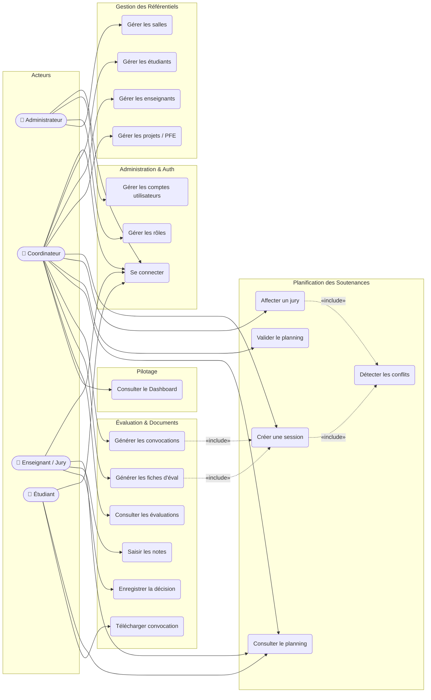
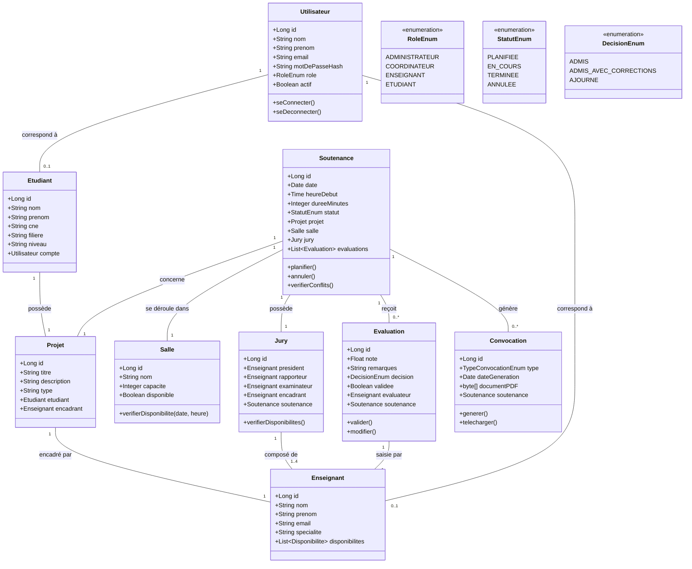
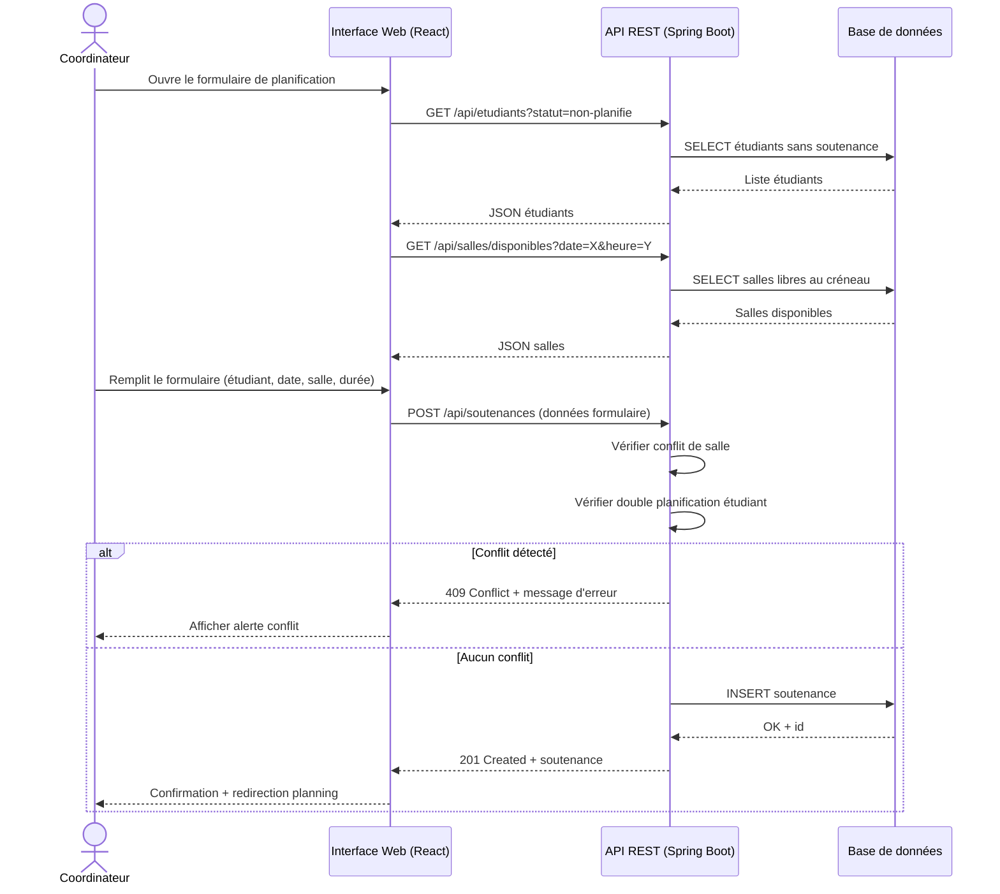
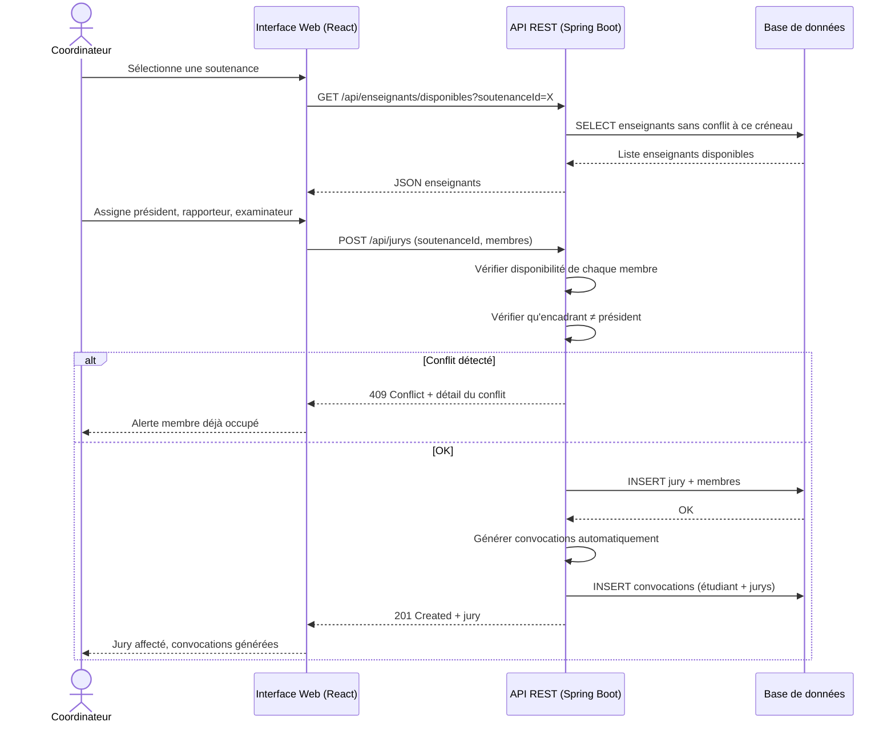
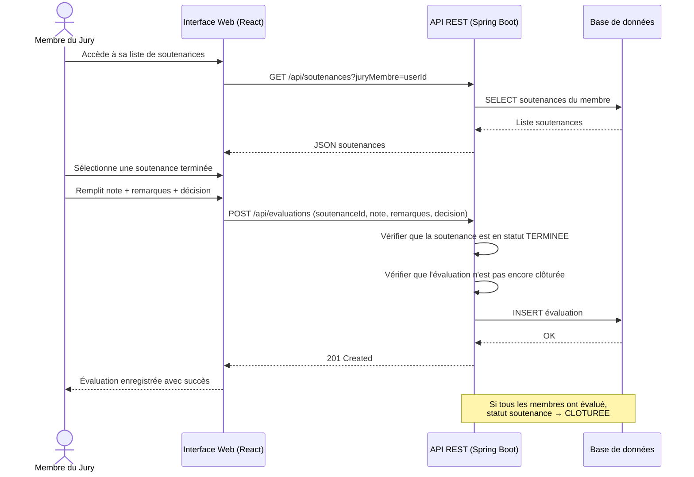
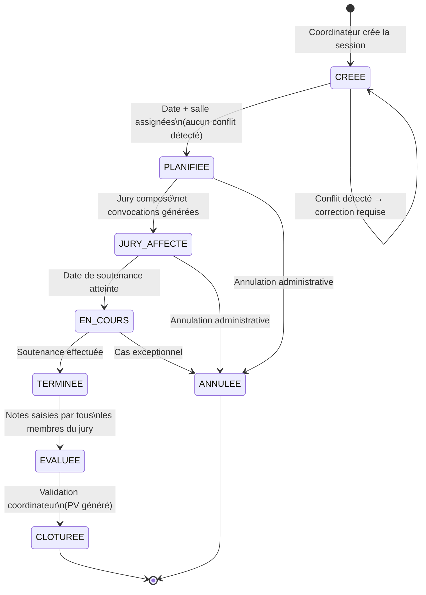
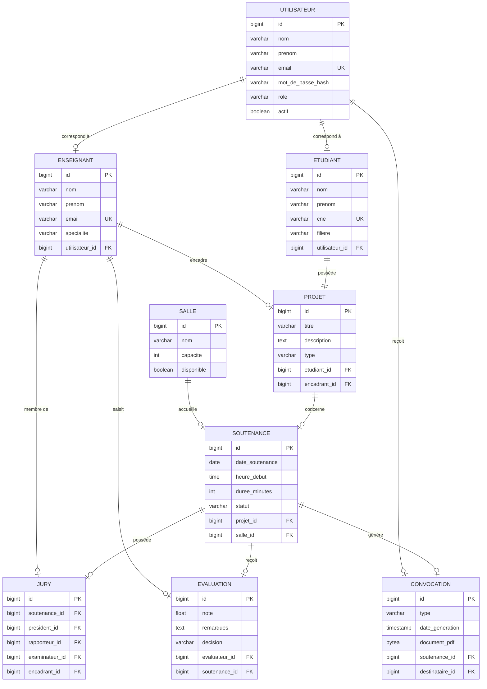
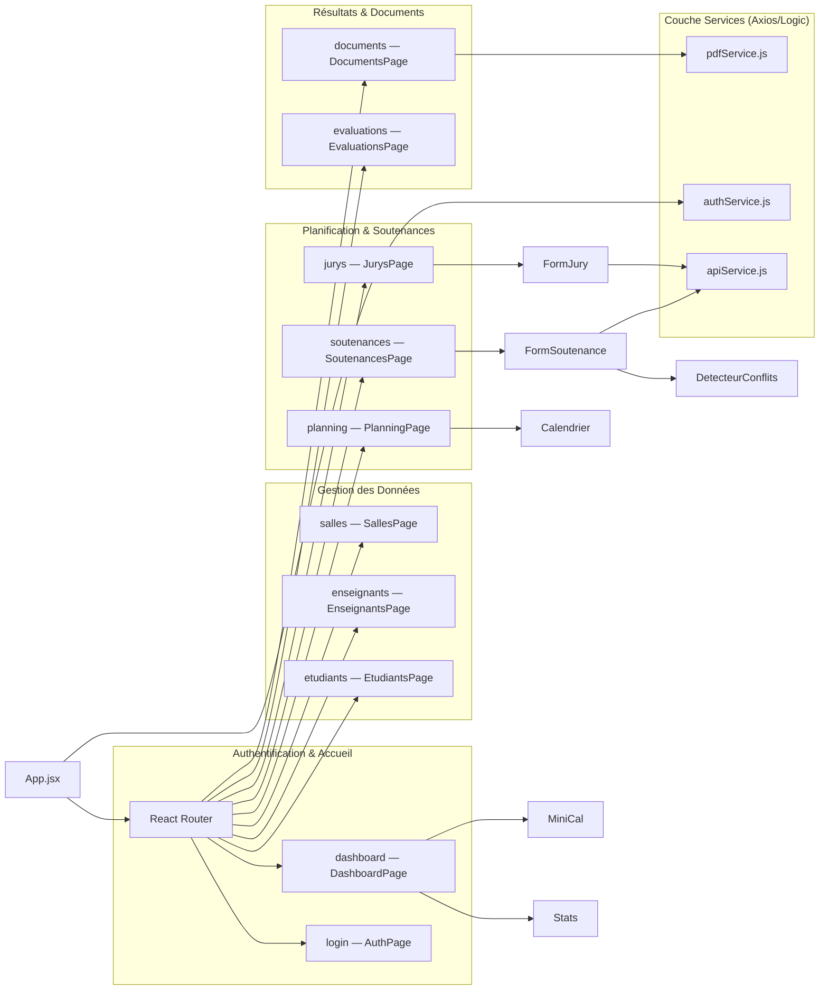

# Diagrammes UML

## Système de Gestion des Soutenances et des Jurys

> **Projet :** PFE Licence Informatique  
> **Date :** Avril 2026

---

## 1. Diagramme de Cas d'Utilisation (Use Case)

---

## 2. Diagramme de Classes

---

## 3. Diagramme de Séquence — Planification d'une Soutenance

---

## 4. Diagramme de Séquence — Affectation d'un Jury

---

## 5. Diagramme de Séquence — Saisie d'une Évaluation

---

## 6. Diagramme d'État — Cycle de vie d'une Soutenance

---

## 7. Schéma Relationnel de la Base de Données

---

## 8. Architecture des Composants Frontend (React)

---

## 9. Récapitulatif des Diagrammes produits

| Diagramme                   | Type UML       | Objectif                            |
| --------------------------- | -------------- | ----------------------------------- |
| Cas d'utilisation           | Use Case       | Identifier les acteurs et fonctions |
| Diagramme de classes        | Structurel     | Modéliser les entités et relations  |
| Séquence — Planification    | Comportemental | Flux de création d'une soutenance   |
| Séquence — Affectation jury | Comportemental | Flux de composition d'un jury       |
| Séquence — Évaluation       | Comportemental | Flux de saisie des notes            |
| Diagramme d'état            | Comportemental | Cycle de vie d'une soutenance       |
| Schéma relationnel (ER)     | Données        | Structure de la base de données     |
| Architecture composants     | Structurel     | Organisation du frontend React      |
